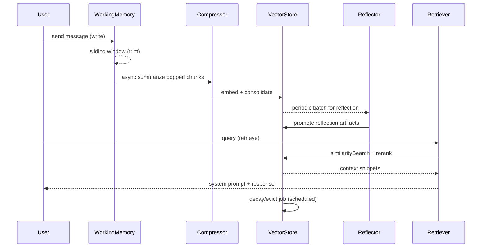

# Memory Lifecycle

## End-to-end flow

在 dawn-ai 语境下，记忆生命周期是从“写入 Working Memory”到“最终遗忘/淘汰”的闭环：

write -> trim -> summarize -> consolidate -> reflect -> retrieve -> decay/evict

以下文档描述每一阶段的责任人（组件）、数据变换、触发条件、失败点及降级钩子。

---

## Stage-by-stage responsibilities

| Stage | Dawn‑ai term | 存储 | 主要责任组件 | 产物 |
|---|---|---:|---|---|
| write | Working Memory | Redis List / in‑process buffer | Memory Router / WorkingMemoryService | 原始消息（Message object） |
| trim | Token Bounding / Sliding Window | Redis / in‑mem | WorkingMemoryService | 被弹出的消息段（raw） |
| summarize | Summary Memory (压缩) | VectorDB / Document store + metadata | MemoryCompressor / Summarizer | 提炼后的 Summary 文档（文本 + metadata + embedding） |
| consolidate | Consolidation / Persist | VectorDB + SQL(KV) | Consolidator / VectorStoreWriter | 持久化 Document（sessionId, time, importance） |
| reflect | Reflection / Promote | VectorDB + Profile store | ReflectionWorker / Planner | Reflection artifact（高权重事实 / persona） |
| retrieve | Retrieval / Context injection | VectorDB + Filters | Retriever / Reranker | 检索到的 Context snippets（用于注入 system prompt；如需外部知识检索（RAG），该检索属于相邻子系统，非核心 memory lifecycle 的一部分） |
| decay/evict | Decay / Eviction | VectorDB + TTL or retention index | EvictionPolicyManager | 标记为低权重或删除的记忆 ID |

---

## Trigger conditions

- Summary (summarize)
  - 触发条件示例：Working Memory 条目数 > 20 OR token budget > 4000 tokens OR 会话闲置 N 秒（如 30s）时。
  - 实际触发动作：异步调用 Summarizer，对被弹出或过期的消息做结构化抽取与摘要。

- Consolidation (consolidate)
  - 触发条件示例：用户离线 / 会话结束 / 定期批处理（如每 5 分钟）或 summarize 完成后。
  - 实际触发动作：向量化（embedding)、写入 VectorDB，并将任何 profile/attribute 更改写为候选（candidate）记录或 KV 条目以待后续 reflection/validation 评估；不直接将候选提升为 Semantic/Hard Memory。

- Reflection (reflect)
  - 触发条件示例：积累的 episodic 条目数量超过阈值（例如 50 条）或检测到行为模式（如多次查询相似主题）。
  - 实际触发动作：运行高阶 LLM prompt 做高维归纳（persona/interest/skill），并将结果提升为高权重记忆或更新 profile。

- Retrieval (retrieve)
  - 触发条件示例：每次用户发起请求时按需检索；或显式工具/步骤请求（如需补充上下文时）。
  - 注：外部知识检索（RAG）为相邻子系统，用于补充外部知识，非核心 memory 生命周期的一部分。
  - 实际触发动作：混合检索（dense + sparse），应用 metadata filter、time decay rerank，返回 top‑k 文档注入 system prompt。

- Eviction (decay/evict)
  - 触发条件示例：存储成本阈值、低重要性评分、长期未命中、或策略调度（例如每周一次冷存/删减）。
  - 实际触发动作：标记 low‑weight、降级到 archive 或物理删除；同时保留回溯链以便审计（如果需要）。

---

## Data transformations

每个阶段的数据变换简要列举：

- write: user/system message -> Message object (id, role, content, ts)
- trim: Message object chunk -> candidate for summarization (window slice)
- summarize: raw messages -> {summary_text, entities_json, importance_score, ts}
- consolidate: summary -> {embedding, metadata(sessionId, tags, ts, importance)} -> VectorDB document + candidate profile/attribute updates (pending); 不直接将候选提升为 Semantic/Hard Memory，需通过 reflect/validation 促进升级。
- reflect: set of summaries/events -> {reflection_text, promoted_flags, updated_profile_fields}
- retrieve: embedding(query) + VectorDB -> ranked snippets -> prompt injection (system prompt section)
- decay/evict: document -> archived/deleted + tombstone metadata for audit

---

## Failure points and fallback hooks

列出明确的失败点与工程级降级钩子（documentation level）。

1) Summarizer timeout / hallucination
   - Failure: LLM 压缩超时或产生错误实体（幻觉）。
   - Fallback hooks:
     - A: 保留原文兜底（原始 message 存档到冷存储）并设置 "pending_review" flag。
     - B: 重试策略：短模型降级重试（low‑cost model）→ 若仍失败，按降级策略保留原文并延迟 consolidate。
     - C: 自动验证器（light validator）校验实体一致性（如 userId 格式），不通过则回滚到原文兜底存储。

2) VectorDB write failure
   - Failure: 网络/数据库写入失败。
   - Fallback hooks:
     - A: 写入队列（persistent queue） + 增量重试（指数退避）
     - B: 将 artifact 写到持久化日志（append‑only file / SQL）以供离线补写
     - C: 监控告警（metric + alert）并降级告知用户："记忆暂时不可用"

3) Retrieval latency / timeout
   - Failure: 检索慢或超时导致用户请求超 SLA
   - Fallback hooks:
     - A: 返回短期 Working Memory 上下文（窗口内最近 N 条）作为最小上下文
     - B: 用最简单的 sparse match（keyword LIKE）作为兜底召回
     - C: 使用 cached prompt fragments（Prompt Cache）快速响应

4) Reflection mispromotion
   - Failure: Reflection 生成的高阶结论被错误提升为核心记忆
   - Fallback hooks:
     - A: 给 Reflection 产物设置 probation（试用期），仅在多次验证后升权
     - B: 人工/自动审计 pipeline（sampling）定期验证 promoted facts
     - C: 可回滚机制：保留 provenance 链并允许降级删除

5) Eviction误删
   - Failure: 有价值记忆被误判并删除
   - Fallback hooks:
     - A: 先 move → archive（冷存）30 天而非立即删除
     - B: Tombstone + provenance 存储（可恢复 ID 列表）
     - C: 删除操作触发审批或阈值外自动审计

注意：所有 fallback 必须为配置项（可通过 feature flags 启用/禁用），并输出可观测事件以便告警与审计。

---

## Metrics to observe

建议的最小可观察指标（Prometheus / OpenTelemetry）：

- agent_memory_write_total{type=working/summary/semantic}
- agent_memory_summarize_latency_seconds (p50/p95)
- agent_memory_consolidation_success_total / failure_total
- agent_memory_vector_write_retries_total
- agent_memory_retrieval_latency_seconds (p50/p95)
- agent_memory_retrieval_hit_ratio{working,summary,semantic}
- agent_memory_eviction_count
- agent_memory_reflection_promotions_total
- agent_memory_hallucination_rate (summarizer validator failures / summaries)

追踪要点：
- 分层命中率（working vs summary vs semantic）
- 概要质量指标（自动校验通过率、人工抽样评分）
- 重试/降级率（用于衡量可靠性）

---

## Stage table (简明视图)

1. write —> 2. trim —> 3. summarize —> 4. consolidate —> 5. reflect —> 6. retrieve —> 7. decay/evict

---

## Sequence flow (Mermaid)

---

## Explicit trigger examples

- Summary
  - Example: Session `s-123` 工作窗口达到 25 条（阈值 20） -> pop oldest 5 条 -> Summarizer 被异步调度，生成 `summary_v1` 并返回 importance_score=0.6。

- Consolidation
  - Example: 用户关闭会话，后台 Consolidator 扫描 `s-123` 的 pending summaries -> 对每个 summary 生成 embedding 并写入 VectorDB，同时为需要更新的 profile 字段（如 last_active_time）生成 candidate 更新记录并标记为 pending；这些候选项需通过 reflection/validation 才会被提升到 Semantic/Hard Memory。

- Reflection
  - Example: 在 7 天内用户有 60 条关于"并发"主题的短期对话 -> ReflectionWorker 被触发，生成 reflection_text："用户偏好深入并发原理"，并将该事实以 high_priority 写入 Semantic/Hard Memory。

- Retrieval
  - Example: 用户问 "我的 VIP 等级是什么？" -> Retriever 首先查 Semantic/Hard Memory（精确匹配），未命中则走 VectorDB top‑k（带 time decay），最后把命中的 profile 注入 system prompt。

- Eviction
  - Example: VectorDB 存储费用达到阈值 -> EvictionPolicyManager 将 importance_score < 0.1 且 last_accessed > 180 天的文档移动到 archive（冷存）并在 30 天后删除。

---

## 参考与一致性要求

- 使用 canonical taxonomy（Working Memory、Summary Memory、Episodic、Semantic/Hard、Procedural）作为术语来源，详见 memory‑taxonomy‑2026‑04‑27.md。
- architecture doc (agent‑memory‑architecture‑2026‑03‑10.md) 描述的组件接口应作为实现参考，本 lifecycle 文档不修改架构稿。

---

（文档作者：dawn‑ai 文档集；日期：2026‑04‑27）
